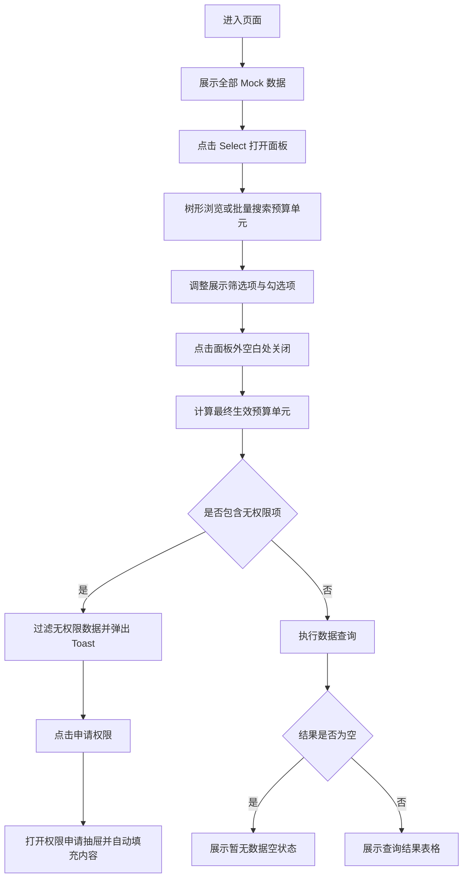

## 1. 产品概述
本项目是一个“高级预算单元级联选择器”单页交互 Demo，用于演示预算单元在复杂筛选、批量搜索、权限拦截、级联多选与查询反馈场景中的完整前端闭环。
- 目标用户为需要在管理台中快速圈选预算单元并触发数据查询的业务运营、财务分析与权限申请用户。
- 产品价值在于用高保真交互复现真实后台筛选器的复杂决策路径，便于方案评审、交互验证和后续工程实现。

## 2. 核心功能

### 2.1 功能模块
1. **筛选触发器**：展示占位提示、已选数量、打开/关闭面板交互。
2. **级联选择面板**：支持树结构浏览、多级勾选、父子联动、高亮状态、右侧已选列表。
3. **批量搜索面板**：支持名称模糊搜索与名称/ID 混合精确搜索，支持多分隔符输入与“全选当前搜索结果”。
4. **权限与状态拦截**：支持“仅展示有权限的预算单元”、无权限可勾选、已失效灰态展示、点击空白处后统一拦截。
5. **查询结果区域**：根据关闭面板后的最终条件刷新表格或空状态。
6. **权限申请抽屉**：从 Toast 操作入口打开，自动带入资源类型与申请原因。
7. **历史记忆恢复**：支持模拟非首次进入，恢复上次选择与查询条件。

### 2.2 页面详情
| 页面名称 | 模块名称 | 功能描述 |
|-----------|-----------|-----------|
| 预算单元筛选 Demo 页 | 页面头部说明区 | 展示标题、副标题、模拟非首次进入按钮与当前筛选摘要 |
| 预算单元筛选 Demo 页 | Select 触发器 | 点击展开面板，显示占位符“请选择预算单元”或已选数量 |
| 预算单元筛选 Demo 页 | 下拉面板顶部 | 多行搜索输入框，支持逗号、空格、换行分词；展示两个筛选复选框 |
| 预算单元筛选 Demo 页 | 下拉面板左栏 | 默认展示预算单元级联树；输入搜索后切换为搜索结果平铺列表 |
| 预算单元筛选 Demo 页 | 搜索结果工具条 | 当存在搜索词时显示“全选当前搜索结果”复选框，用于批量加入当前可见结果 |
| 预算单元筛选 Demo 页 | 下拉面板右栏 | 独立滚动的“已选择区域”，支持查看和移除选中项 |
| 预算单元筛选 Demo 页 | Toast 提示区 | 在权限拦截时提示无权限预算单元，并提供“申请权限”操作 |
| 预算单元筛选 Demo 页 | 权限申请抽屉 | 右侧滑出，默认资源类型为“预算单元”，申请原因自动填充无权限项名称 |
| 预算单元筛选 Demo 页 | 查询结果表格区 | 首次展示全部 Mock 数据；关闭面板后根据条件更新结果；无数据时展示空状态 |

## 3. 核心流程
用户首次进入页面时，未选择任何预算单元，表格展示全部 Mock 数据。用户点击筛选触发器后，可在级联树中逐级勾选，也可在顶部搜索框中输入名称或 ID 进行批量搜索与批量勾选。选择过程中的结果先保存在面板内部状态，不立即触发表格查询。只有当用户点击面板外部关闭筛选器时，系统才会根据“按 1 级预算单元筛选”规则计算最终生效条件，并执行一次模拟查询。

若本次最终已选预算单元中包含无权限项，系统仍保留选中状态，但查询结果中不展示这些无权限项对应的数据，并在页面顶部弹出 Toast 说明哪些预算单元暂无权限。用户点击“申请权限”后，右侧抽屉展开，默认带入资源类型和申请原因。若全部有权限但没有任何数据命中，则表格区切换为“暂无数据”空状态。

## 4. 用户界面设计
### 4.1 设计风格
- 主色与强调色：以 Arco 风格的清透蓝为主色，辅以浅灰、白色与轻量阴影形成精致企业后台视觉。
- 按钮与输入框：中等圆角、细边框、清晰 hover/focus ring、轻阴影浮层。
- 字体与字号：采用系统中文无衬线字体栈，标题偏稳重，正文强调可读性与层级感。
- 布局样式：桌面优先，卡片式页面容器 + 宽幅下拉浮层 + 固定右栏结构。
- 图标风格建议：使用简洁线性风格图标，配合箭头、搜索、关闭、权限、空状态等语义图标。

### 4.2 页面设计概览
| 页面名称 | 模块名称 | UI 元素 |
|-----------|-----------|-----------|
| 预算单元筛选 Demo 页 | 页面容器 | 居中卡片布局、淡灰背景、精致投影、顶部信息区 |
| 预算单元筛选 Demo 页 | Select 触发器 | 类 Arco Select，高度 40px，浅灰边框，展开时蓝色焦点边框 |
| 预算单元筛选 Demo 页 | 下拉浮层 | 宽度约 800px，圆角 16px，白底，分区清晰，带柔和阴影 |
| 预算单元筛选 Demo 页 | 搜索输入框 | 多行 TextArea，淡灰背景，蓝色 focus ring，带提示文本 |
| 预算单元筛选 Demo 页 | 级联树/搜索列表 | 左栏主交互区，支持层级缩进、状态标签、hover 高亮与批量选择工具条 |
| 预算单元筛选 Demo 页 | 已选择区域 | 右栏固定宽度，独立滚动，胶囊标签或行式清单，支持删除按钮 |
| 预算单元筛选 Demo 页 | Toast | 页面顶部中央悬浮，浅色信息底，蓝色可点击操作文案 |
| 预算单元筛选 Demo 页 | 抽屉 | 右侧滑出，白底，表单输入与只读默认值清晰分层 |
| 预算单元筛选 Demo 页 | 表格/空状态 | 类 Arco Table 与 Empty 风格，表头清晰、数据行轻边框、空态图形简洁 |

### 4.3 响应式策略
采用桌面优先设计，核心体验针对大屏管理台宽度优化。在中等屏宽下允许下拉面板压缩为上下布局；在较小屏幕下允许面板纵向堆叠，保证搜索、选择与已选区域仍可操作。
