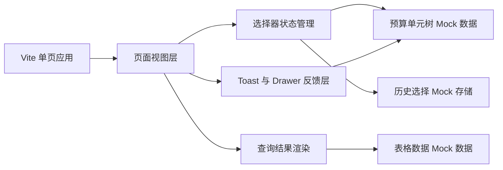
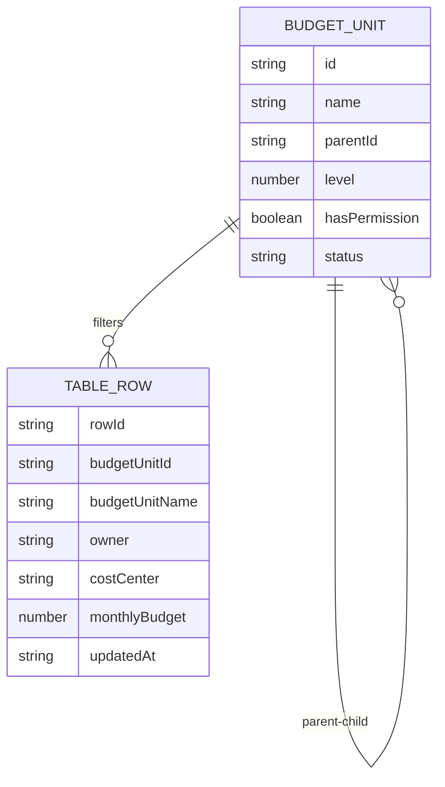

## 1. 架构设计
本 Demo 采用纯前端单页架构，不依赖真实后端服务。页面中的预算单元树、权限状态、表格数据、历史记忆与申请权限行为均由浏览器内 Mock 数据与状态管理驱动。



## 2. 技术描述
- 前端：React 18 + TypeScript + Vite + Tailwind CSS
- 状态管理：React 原生状态与派生计算，不引入额外全局状态库
- 交互实现：原生事件监听 + React Portal 思路的浮层渲染（可在单文件中完成）
- 数据模拟：本地常量 Mock 树数据、Mock 表格数据、`localStorage` 历史记忆
- 样式策略：Tailwind CSS 负责基础布局与状态样式，局部补充自定义 CSS 还原 Arco 风格

## 3. 路由定义
| 路由 | 用途 |
|-------|------|
| / | 高级预算单元级联选择器 Demo 单页 |

## 4. API 定义
本项目不接入真实后端，使用前端 Mock 函数模拟接口行为。

```ts
type BudgetUnitStatus = 'active' | 'expired';

interface BudgetUnitNode {
  id: string;
  name: string;
  parentId: string | null;
  level: 1 | 2 | 3;
  hasPermission: boolean;
  status: BudgetUnitStatus;
  children?: BudgetUnitNode[];
}

interface QueryTableRow {
  rowId: string;
  budgetUnitId: string;
  budgetUnitName: string;
  owner: string;
  costCenter: string;
  monthlyBudget: number;
  updatedAt: string;
}

interface ApplyPermissionPayload {
  resourceType: '预算单元';
  reason: string;
}
```

Mock 查询函数约束：
1. 仅在面板关闭时触发查询。
2. 查询前先根据“按 1 级预算单元筛选”计算最终筛选 ID 集合。
3. 查询结果中自动排除无权限预算单元的数据。
4. 若存在无权限选择项，返回拦截提示元信息供 Toast 使用。

## 5. 数据模型
### 5.1 数据模型定义


### 5.2 初始数据设计
1. 树数据至少包含三级结构：
   - 一级：智能语音交互、行业 PaaS、基础深度学习
   - 二级：扣子、豆包大模型、隐私计算平台
   - 三级：扣子(子项A)、扣子(子项B)
2. 节点属性需覆盖：
   - 有权限 / 无权限
   - 正常 / 已失效
   - 层级、父子关系、名称、ID
3. 表格数据需覆盖：
   - 有权限命中数据
   - 无权限命中但被过滤的数据
   - 查询为空的数据路径

## 6. 关键实现说明
1. 组件拆分建议：
   - 页面框架组件
   - 预算单元选择器组件
   - 树节点行组件
   - 搜索结果列表组件
   - 已选区域组件
   - Toast 与 Drawer 组件
   - 表格与 Empty 组件
2. 搜索策略：
   - 单 token 时同时做名称模糊匹配与 ID 精确匹配
   - 多 token 时优先按名称或 ID 的精确包含匹配
   - 支持逗号、中文逗号、空格、换行混合分隔
3. 选择策略：
   - 内部维持原始勾选集合
   - 最终查询前再计算是否提升到一级预算单元
   - 右侧已选区域始终展示原始勾选结果，避免用户失去感知
4. 权限策略：
   - “仅展示有权限的预算单元”只控制展示，不限制勾选
   - 点击空白关闭时统一识别无权限项并弹 Toast
   - 申请权限抽屉自动拼接无权限项名称进入申请原因
